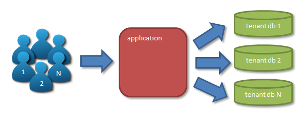

## Multi-tenancy database Spring Boot demo project

### A simple single-class solution with support for dynamic loading of the tenant datasources

#### Description
This solution utilizes the separate schema of [multi-tenant data approaches][1]:



To implement multi-tenancy with Spring Boot we can use [AbstractRoutingDataSource][2] as base **DataSource** class for all '*tenant databases*'. 

It has one abstract method [determineCurrentLookupKey][3] that we have to override. It tells the `AbstractRoutingDataSource` which of the tenant datasource it have to provide at the moment to work with. Because it work in the multi-threading environment, the information of the chosen tenant should be stored in `ThreadLocal` variable. 

The `AbstractRoutingDataSource` stores the info of the tenant datasources in its private `Map<Object, Object> targetDataSources`. The key of this map is a **tenant identifier** (for example the String type) and the value - the **tenant datasource**. To put our tenant datasources to this map we have to use its setter `setTargetDataSources`.

The `AbstractRoutingDataSource` will not work without 'default' datasource which we have to set with method `setDefaultTargetDataSource(Object defaultTargetDataSource)`.

After we set the tenant datasources and the default one, we have to invoke method `afterPropertiesSet()` to tell the `AbstractRoutingDataSource` to update its state.

So our 'MultiTenantManager' class in the basic version can be like this:

```java
@Configuration
public class MultiTenantManager {

    private final ThreadLocal<String> currentTenant = new ThreadLocal<>();
    private final Map<Object, Object> tenantDataSources = new ConcurrentHashMap<>();
    private final DataSourceProperties properties;

    private AbstractRoutingDataSource multiTenantDataSource;

    public MultiTenantManager(DataSourceProperties properties) {
        this.properties = properties;
    }

    @Bean
    public DataSource dataSource() {
        multiTenantDataSource = new AbstractRoutingDataSource() {
            @Override
            protected Object determineCurrentLookupKey() {
                return currentTenant.get();
            }
        };
        multiTenantDataSource.setTargetDataSources(tenantDataSources);
        multiTenantDataSource.setDefaultTargetDataSource(defaultDataSource());
        multiTenantDataSource.afterPropertiesSet();
        return multiTenantDataSource;
    }

    public void addTenant(String tenantId, String url, String username, String password) throws SQLException {

        DataSource dataSource = DataSourceBuilder.create()
                .driverClassName(properties.getDriverClassName())
                .url(url)
                .username(username)
                .password(password)
                .build();

        // Check that new connection is 'live'. If not - throw exception
        try(Connection c = dataSource.getConnection()) {
            tenantDataSources.put(tenantId, dataSource);
            multiTenantDataSource.afterPropertiesSet();
        }
    }

    public void setCurrentTenant(String tenantId) {
        currentTenant.set(tenantId);
    }

    private DriverManagerDataSource defaultDataSource() {
        DriverManagerDataSource defaultDataSource = new DriverManagerDataSource();
        defaultDataSource.setDriverClassName("org.h2.Driver");
        defaultDataSource.setUrl("jdbc:h2:mem:default");
        defaultDataSource.setUsername("default");
        defaultDataSource.setPassword("default");
        return defaultDataSource;
    }
}
```

**Brief explanation**

- map `tenantDataSources` it's our local tenant datasource storage which we put to the `setTargetDataSources` setter;

- `DataSourceProperties properties` is used to get Database Driver Class name of tenant database from the `spring.datasource.driverClassName` of the 'application.properties' (for example, `org.postgresql.Driver`);

- method `addTenant` is used to add a new tenant and its datasource to our local tenant datasource storage. **We can do this on the fly** - thanks to the method `afterPropertiesSet()` (see example [here](service/src/main/java/io/github/cepr0/demo/controller/TenantController.java));

- method `setCurrentTenant(String tenantId)` is used to 'switch' onto datasource of the given tenant. We can use this method, for example, in the REST controller when handling a request to work with database. The request should contain the 'tenantId', for example in the `X-TenantId` header, that we can retrieve and put to this method;

- `defaultDataSource()` is build with in-memory H2 Database to avoid the using the default database on the working SQL server.

Note: we **must** set `spring.jpa.hibernate.ddl-auto` parameter to `none` to disable the Hibernate make changes in the database schema. We have to create schema of tenant databases beforehand.

#### Loading tenant datasource dynamically

To realize this we can add to the class new property `tenantResolver` and it's setter:

```java
   private Function<String, DataSourceProperties> tenantResolver;

   public void setTenantResolver(Function<String, DataSourceProperties> tenantResolver) {
       this.tenantResolver = tenantResolver;
   }
```
It will work as supplier of tenantId and its datasource. Then we can update the `setCurrentTenant` method:

```java
    public void setCurrentTenant(String tenantId) throws SQLException, TenantNotFoundException, TenantResolvingException {
        if (tenantIsAbsent(tenantId)) {
            if (tenantResolver != null) {
                DataSourceProperties properties;
                try {
                    properties = tenantResolver.apply(tenantId);
                } catch (Exception e) {
                    throw new TenantResolvingException(e, "Could not resolve the tenant!");
                }
                String url = properties.getUrl();
                String username = properties.getUsername();
                String password = properties.getPassword();
    
                addTenant(tenantId, url, username, password);
            } else {
                throw new TenantNotFoundException(format("Tenant %s not found!", tenantId));
            }
        }
        currentTenant.set(tenantId);
    }
```  

If tenantId not found in the local storage then we try to resolve them (if resolver is not null) and add it and its datasource parameters.  

Now, during the next request to the our rest controller (for example), the code will check whether the tenant datasource is present in the local storage and, 
if it does not exist, will load its parameters dynamically.

Full code of the `MultiTenantManager` you can find [here](multitenant/src/main/java/io/github/cepr0/demo/multitenant/MultiTenantManager.java).

#### Usage example

Will be added...

  [1]: http://docs.jboss.org/hibernate/orm/current/userguide/html_single/Hibernate_User_Guide.html#multitenacy-approaches
  [2]: https://docs.spring.io/spring/docs/current/javadoc-api/org/springframework/jdbc/datasource/lookup/AbstractRoutingDataSource.html
  [3]: https://docs.spring.io/spring/docs/current/javadoc-api/org/springframework/jdbc/datasource/lookup/AbstractRoutingDataSource.html#determineCurrentLookupKey--
